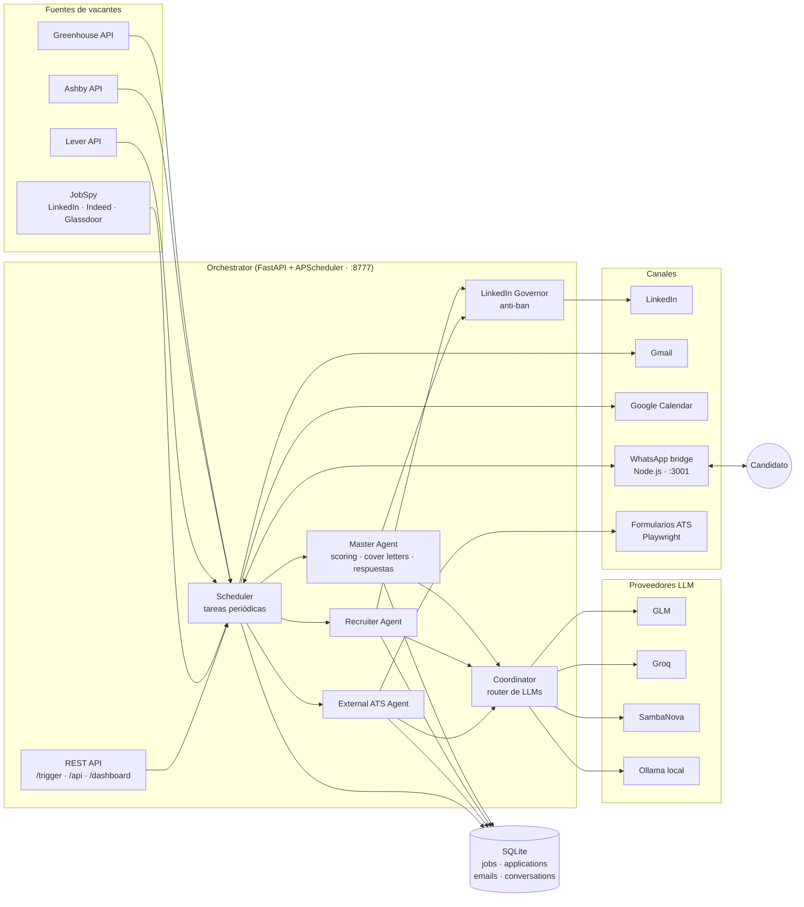
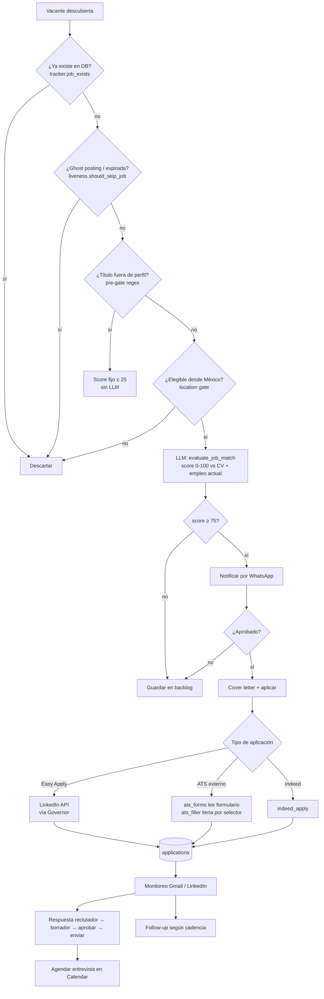
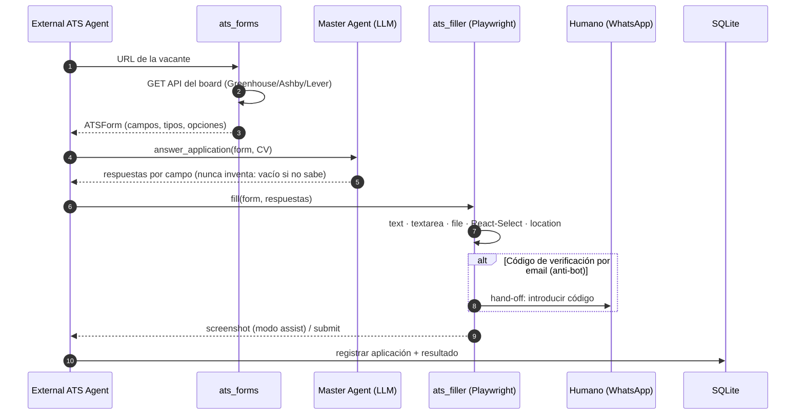
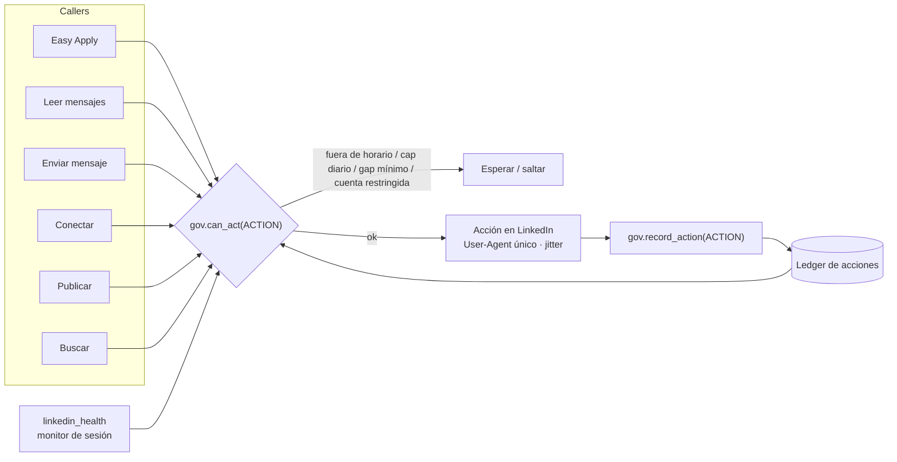
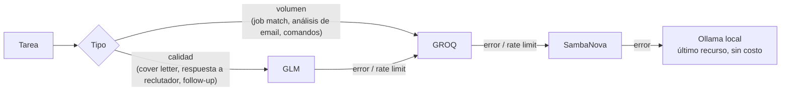

# JobSearcher — agente autónomo de búsqueda de empleo

Sistema multi-agente en Python que **busca vacantes, las evalúa contra tu CV, aplica, monitorea respuestas de reclutadores y agenda entrevistas**, manteniendo siempre a un humano en el circuito vía WhatsApp para las decisiones importantes.

[](https://www.python.org/)
[](https://fastapi.tiangolo.com/)
[](https://playwright.dev/)

## Características

- **Búsqueda zero-token** en APIs públicas de Greenhouse, Ashby y Lever (`portal_scanner`) + JobSpy (LinkedIn/Indeed/Glassdoor) como respaldo.
- **Filtros gratuitos antes del LLM**: dedup en SQLite, detector de *ghost postings* (`liveness`), pre-gate por título y elegibilidad de ubicación.
- **Scoring 0-100** de cada vacante contra el CV y contra tu empleo actual (solo pasa lo que es *mejor opción*).
- **Aplicación automática**: LinkedIn Easy Apply, Indeed y ATS externos (Greenhouse/Lever/Ashby) leyendo el formulario por API y llenándolo por selector con Playwright.
- **Gobernador anti-ban de LinkedIn**: un único *choke point* con presupuesto por acción y por cuenta, horario laboral, jitter, warmup y detección de restricciones.
- **Monitoreo** de Gmail (30 min) y mensajes de LinkedIn; borradores de respuesta a reclutadores con aprobación humana.
- **Calendario**: propone slots libres y crea eventos de entrevista en Google Calendar.
- **Follow-ups** con cadencia diferenciada por estado del pipeline.
- **Router de LLMs** con fallback en cascada (GLM → Groq → SambaNova → Ollama local).
- **Dashboard web** y API REST para disparar cualquier tarea manualmente.

---

## Arquitectura

### Vista general



### Pipeline de una vacante

Cada etapa barata corre antes que la siguiente más cara: el LLM solo ve vacantes que ya pasaron todos los filtros gratuitos.



### Aplicación a ATS externos

En lugar de un loop de visión paso a paso, el formulario se lee estructuradamente desde la API pública del ATS, se responde una sola vez y se llena de forma determinista.



### Gobernador anti-ban de LinkedIn

LinkedIn banea por actividad **total** de la cuenta, no por script. Por eso **todo** acceso a LinkedIn pasa por un único módulo:



### Router de LLMs



### Tareas programadas

| Tarea | Frecuencia | Qué hace |
|---|---|---|
| `portal_scan` | 4 h | Scan zero-token de Greenhouse/Ashby/Lever según `config/portals.yml` |
| `job_search` | 8 h | Búsqueda JobSpy con filtro de liveness |
| `external_ats` | periódica | Aplica a la cola de ATS externos |
| `indeed_apply` | 3 h | Aplicación en Indeed |
| `linkedin_messages` | 15 min (gateada por el governor) | Lee mensajes de reclutadores |
| `email_monitor` | 30 min | Clasifica correos de Gmail |
| `followup` | diaria | Follow-ups según cadencia por estado |
| `score_pending` | periódica | Puntúa el backlog (con fallback a LLM local) |
| `pipeline_health` / `linkedin_health` | periódica | Salud del pipeline y de la sesión |

---

## Estructura del repositorio

```
.
├── run.py                    # Entry point: arranca el orchestrator (uvicorn :8777)
├── config/
│   ├── settings.py           # Configuración (pydantic-settings, lee .env)
│   └── portals.yml           # Empresas a escanear + filtros de título/ubicación
├── src/
│   ├── orchestrator.py       # FastAPI + APScheduler + webhook WhatsApp
│   ├── agents/               # master, recruiter, external_ats, coordinator, ...
│   ├── tools/                # portal_scanner, jobspy, liveness, linkedin_governor,
│   │                         # gmail, calendar, whatsapp, browser, ats_forms, ats_filler
│   ├── db/tracker.py         # Capa SQLite
│   └── dashboard.py          # Dashboard web
├── services/whatsapp/        # Bridge Node.js (whatsapp-web.js)
├── modes/                    # Instrucciones por modo para agentes de código (Claude Code)
├── scripts/                  # Utilidades: scoring de backlog, generación de CV, etc.
└── docs/                     # Documentación adicional
```

---

## Instalación

### Requisitos

- Python 3.10+
- Node.js 20+ (para el bridge de WhatsApp)
- Chromium para Playwright
- Al menos una API key de LLM (Groq tiene free tier) o [Ollama](https://ollama.com/) local

### Pasos

```bash
git clone git@github.com:alejandro-loza/jobSearcher.git
cd jobSearcher

# Python
python -m venv venv
venv/bin/pip install -r requirements.txt playwright
venv/bin/playwright install chromium

# WhatsApp bridge
cd services/whatsapp && npm install && cd ../..

# Configuración
cp .env.example .env                       # llena tus API keys
cp modes/_profile.example.md modes/_profile.md
mkdir -p data
```

### Datos locales (nunca se suben al repo)

| Archivo | Contenido |
|---|---|
| `.env` | API keys y configuración |
| `data/resume.json` | Tu CV estructurado (lo usa el scoring y los formularios) |
| `data/current_job.json` | Empleo actual: línea base que toda vacante debe superar |
| `data/*.pdf` | CV en PDF para adjuntar |
| `config/google_credentials.json` | OAuth client de Google Cloud |
| `config/gmail_token.json`, `config/calendar_token.json` | Tokens generados por `authorize_google.py` |
| `config/linkedin_cookies.json` | Cookies de sesión de LinkedIn (`li_at`, `JSESSIONID`) |
| `modes/_profile.md` | Tu perfil y preferencias para los agentes |

Ejemplo de `data/current_job.json`:

```json
{
  "empresa": "Empresa actual",
  "rol": "Sr Software Engineer",
  "compensacion": "$XX,000 MXN",
  "modalidad": "Híbrida",
  "ingreso": "2026-01-01"
}
```

### Autorizar Google (Gmail + Calendar)

1. Crea un OAuth client (Desktop) en Google Cloud Console y guárdalo como `config/google_credentials.json`.
2. Ejecuta `venv/bin/python authorize_google.py` y acepta los permisos en el navegador.

---

## Uso

```bash
# 1. Bridge de WhatsApp (escanea el QR la primera vez)
cd services/whatsapp && npm start

# 2. Orchestrator
venv/bin/python run.py
```

Abre el dashboard en `http://localhost:8777/dashboard`.

### Disparadores manuales

```bash
curl -s  http://localhost:8777/health | python3 -m json.tool
curl -X POST http://localhost:8777/trigger/portal-scan    # zero-token
curl -X POST http://localhost:8777/trigger/search         # JobSpy
curl -X POST http://localhost:8777/trigger/external-ats   # aplica a cola ATS
curl -X POST http://localhost:8777/trigger/apply-all      # aplica a score ≥ 75
curl -X POST http://localhost:8777/trigger/email          # monitor de Gmail
```

### API principal

| Endpoint | Método | Descripción |
|---|---|---|
| `/health`, `/health/linkedin` | GET | Estado del sistema y de la sesión de LinkedIn |
| `/dashboard` | GET | Dashboard web |
| `/pipeline` | GET | Estado del pipeline |
| `/api/jobs`, `/api/applications`, `/api/interviews` | GET | Datos del tracker |
| `/api/chat` | POST | Chat con el agente |
| `/trigger/*` | POST | Ejecuta una tarea al momento |
| `/webhook/whatsapp` | POST | Comandos/aprobaciones desde WhatsApp |

### Añadir empresas al portal scanner

Edita `config/portals.yml`:

```yaml
tracked_companies:
  - name: "Stripe"
    careers_url: "https://boards.greenhouse.io/stripe"
    ats_type: "greenhouse"
    enabled: true
```

### Docker

```bash
docker compose up -d
```

---

## Principios de diseño

1. **Humano en el circuito**: ofertas, negociación salarial y aceptar/declinar siempre se escalan por WhatsApp; el sistema nunca decide solo.
2. **Minimizar tokens**: filtros deterministas (dedup, liveness, regex de título, ubicación) antes de cualquier llamada al LLM.
3. **Nunca inventar**: si el CV no responde un campo del formulario, se deja vacío y se pide intervención.
4. **Un solo choke point para LinkedIn**: caps, horario y jitter viven solo en `linkedin_governor`.
5. **Anti-spam**: nunca responder dos veces a un hilo sin respuesta del reclutador.

## Seguridad

El repositorio **no contiene** credenciales ni datos personales: `.env`, tokens, cookies, la base de datos y `data/` están en `.gitignore`. Antes de contribuir, revisa que tus cambios no incluyan llaves ni datos de contacto.

## Aviso

Automatizar acciones en LinkedIn puede violar sus Términos de Servicio. Úsalo bajo tu propio riesgo y con límites conservadores.
